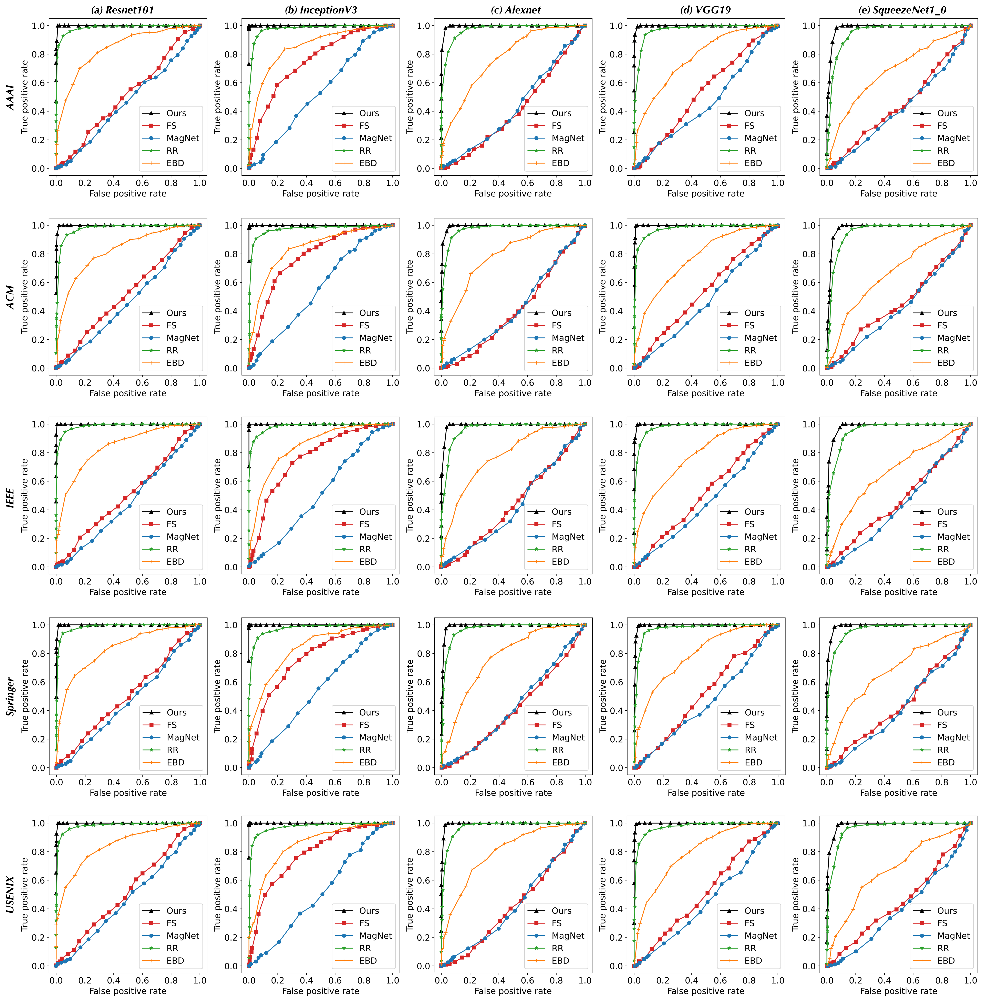
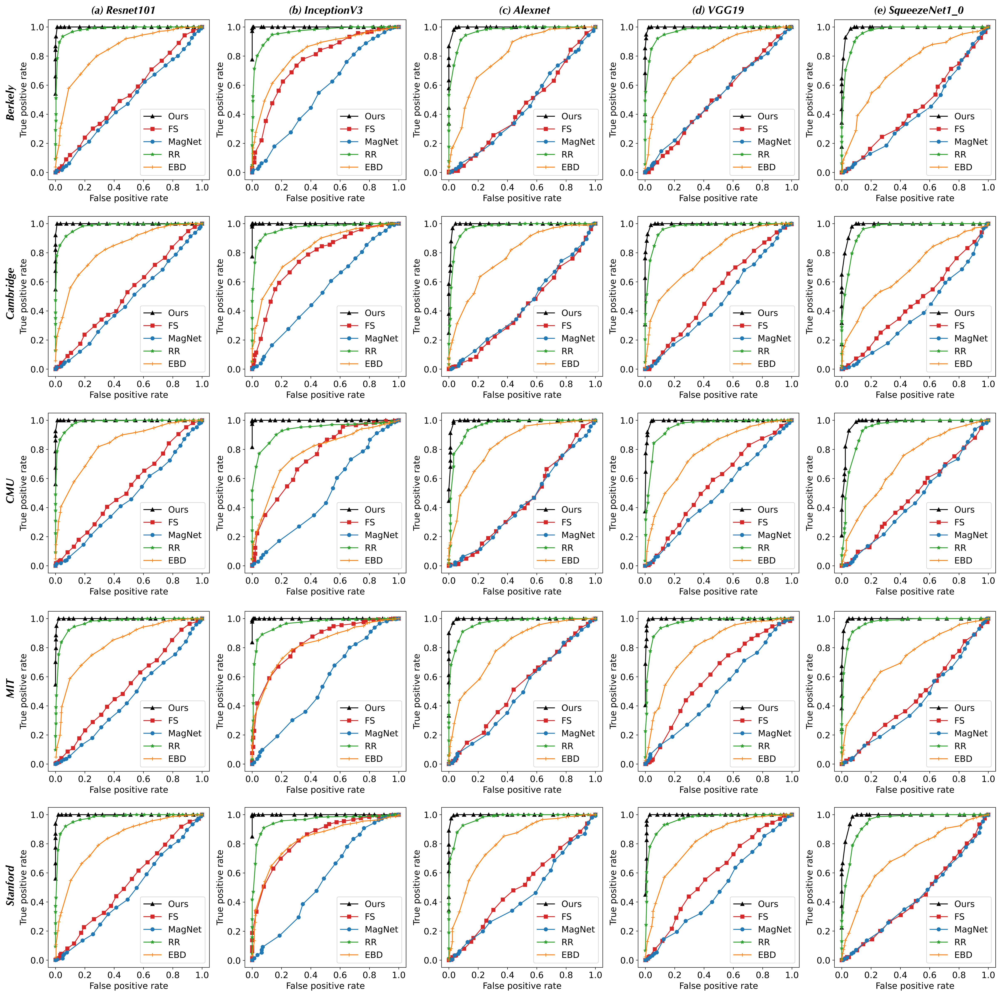
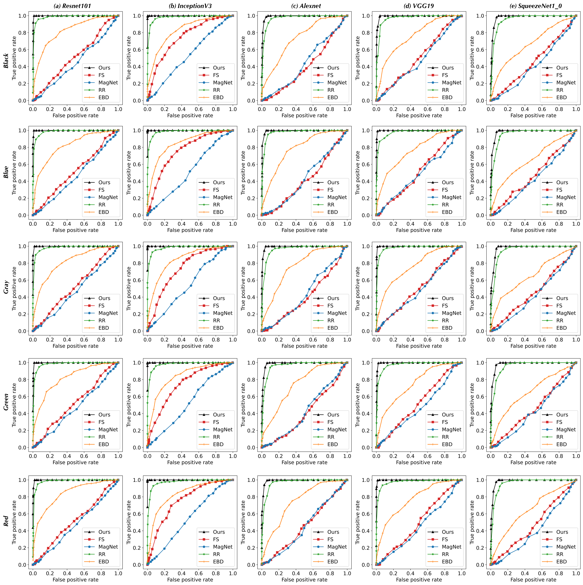

# Themis

## Requirements

```bash
pip install Pillow
pip install torch
pip install torchvision
```

## AEs \& non-AEs

The "aes" folder stores a series of watermark AEs based on the SqueezeNet1_0 classifier. 
The "non-aes" folder stores a series of unsuccessful instances of watermark attacks and clean samples. 

## Pre-trained models

The "model" folder stores a normal SqueezeNet1_0 model (pre-trained weights from the Torchvision library) and an auxiliary model upon the empty inputs, they will be used to calculate the usable information for AE detection. 

## How to use

Execute the following command:
```bash
python detect.py
```

## Evaluation

By changing the drop rate, we plot the ROC curves of Themis and baselines against 15 types of logo watermarks.





